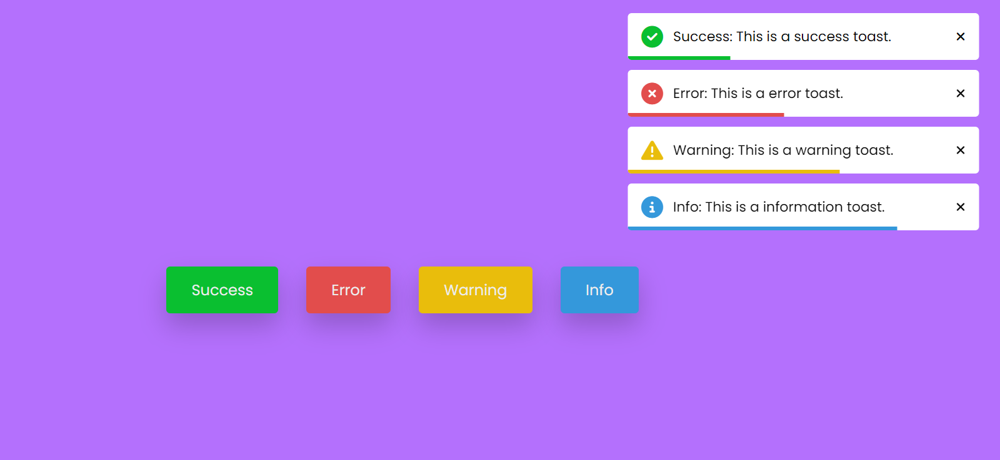

# JavaScript Toast Popup Project

This project is a simple and stylish JavaScript-based toast Notification Popup implementation with a modern UI design. Toast Notification are a convenient way to display non-intrusive messages or notifications to users. This project utilizes HTML, CSS, and JavaScript to create a responsive and visually appealing toast notification that you can easily integrate into your web projects.

## Preview



## Features

- Minimalistic and modern design.
- Customizable content and duration for each toast popup.
- Includes Four Types of Notification Success, Info, Error and Warning

## Getting Started

To use this toast popup in your project, follow these steps:

1. Clone the repository to your local machine:

   ```bash
   git clone https://github.com/yourusername/Toast-Notification.git
   ```

2. Include the necessary files in your project:

   - Copy the `style.css` and `script.js` files into your project directory.
   - Link these files in your HTML file:

     ```html
     <link rel="stylesheet" href="path/to/style.css">
     <script src="path/to/script.js"></script>
     ```

3. Create a toast by calling the `createToast` function in your JavaScript:

   ```javascript
   createToast('Hello, this is a toast message!');
   ```

## Customization

You can customize the toast popup by modifying the `style.css` file. Adjust the colors, animations, and other styles to match your project's design.

## Contributing

If you'd like to contribute to this project, please follow these steps:

1. Fork the repository.
2. Create a new branch for your feature or improvement.
3. Make your changes and commit them with descriptive messages.
4. Push your changes to your forked repository.
5. Open a pull request to merge your changes into the main branch.

Feel free to integrate this modern toast popup into your projects and provide feedback or contribute to its development. Thank you for checking out the JavaScript Toast Popup Project repository!